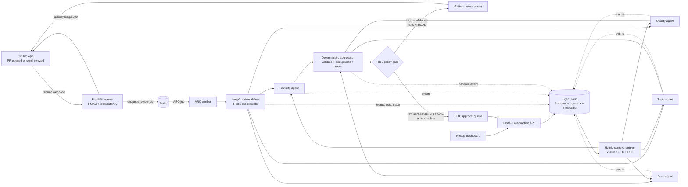
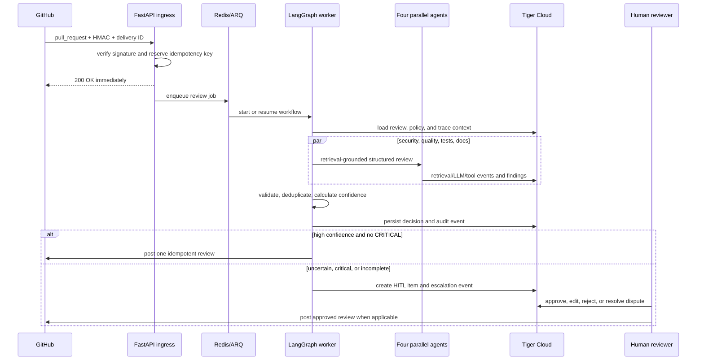
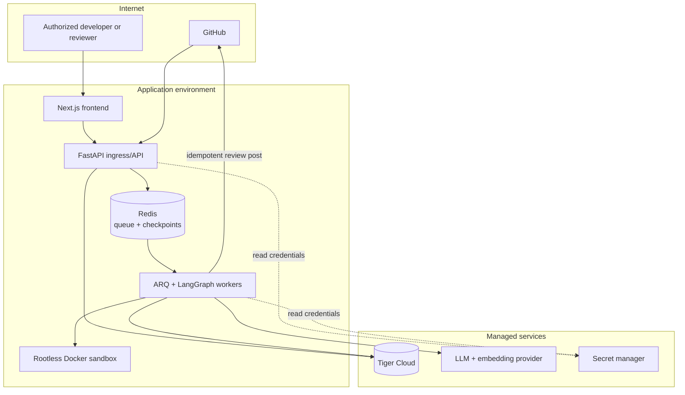

# PR Prep — End-to-End Implementation Plan

## Purpose and delivery rules

PR Prep is a selective automated GitHub pull-request reviewer. Its purpose is to reclaim senior-engineer review time by automatically surfacing grounded, high-value findings, while routing uncertain or high-consequence outcomes to humans. It is not a comment-volume generator and must never trade correctness for speed.

The trigger is a GitHub `pull_request` webhook for opened or updated PRs. The outcome is one structured review, with evidence-backed findings attached to exact files and lines, either posted to GitHub or held in the human approval queue.

The source roadmap calls itself a “20-phase” plan while also naming Phase 0. To preserve both meanings, Phase 0 below is a required design/preflight gate; the 20 implementation phases are Phases 1–20.

### Non-negotiable design constraints

- Build a modular monolith first. `core/` has no dependencies; modules depend inward only. Observability is cross-cutting middleware/injection, not a dependency from core domain code to an outer module.
- Use one durable data spine: Tiger Cloud / Postgres with `pgvector`, `pgvectorscale`/DiskANN, and TimescaleDB. Use Redis only for ARQ jobs, LangGraph checkpoints, and short-lived cache/session state.
- A review runs as four parallel, retrieval-grounded specialists: `security`, `quality`, `tests`, and `docs`. Their output is structured data, never unstructured prose exchanged between nodes.
- Every externally visible or costly action emits an immutable, time-ordered `agent_events` record. The same event spine must support trace, audit, and cost views.
- Validate GitHub HMAC before processing, make webhook handling idempotent on `X-GitHub-Delivery`, acknowledge fast, and process work only from the queue.
- Auto-post only a high-confidence review with no `CRITICAL` finding. Low confidence, any `CRITICAL` finding, or unsafe/failed processing goes to human handling; a developer dispute creates auditable feedback.
- Every phase ends with a reproducible green gate. Do not advance by a manual “looks right” check alone.

### Core contracts

`Finding` is the contract shared by specialists, aggregation, persistence, HITL, API, and GitHub posting:

```text
agent_type, severity, category, summary,
file_path, line_start, line_end, suggestion,
confidence, rationale
```

Add stable IDs, source review/commit identifiers, timestamps, evidence/context references, and status fields in persistence without weakening the fields above. Severity is a closed enum with at least `CRITICAL`, `HIGH`, `MEDIUM`, `LOW`, and `INFO`. Validate file/line references against the PR diff before posting inline comments.

`ReviewState` must carry a review/workflow ID, repository and PR identity, commit SHA, diff, procedural policy, retrieved context references, per-agent findings/results, aggregate decision, and correlation/trace context. Its schema is versioned so checkpoints can be resumed safely.

### Target repository layout

```text
backend/
  agents/ api/ auth/ core/ data/ database/ economics/ evaluation/
  hitl/ integrations/ job_queue/ memory/ models/ observability/
  orchestrator/ prompts/ reliability/ security/ tools/ webhook_receiver/
  scripts/migrations/
frontend/
  src/app/ components/ lib/
docs/
  adr/ runbooks/ threat-model/ operations/
```

The modules are deliberately listed here because their boundaries are part of the architecture. `qdrant_client` must not be introduced; Tiger-backed retrieval replaces it. Keep database access behind repositories/clients: SQLAlchemy async for ordinary relational work and `asyncpg` for hot event-insert and chunk-upsert paths.

## Recommended technology stack

This stack is deliberately small: it supports the required parallel, retrieval-grounded review workflow without introducing separate durable stores or premature microservices. Versions should be pinned in lockfiles and upgraded through Phase 18 evaluation/canary gates rather than selected ad hoc.

| Area | Recommended choice | Why it fits this project |
| --- | --- | --- |
| Web dashboard | Next.js + React + TypeScript + Tailwind CSS | Required dashboard technology; type-safe UI for review, HITL, trace, and economics pages. |
| API and domain service | Python 3.12+, FastAPI, Pydantic v2 | Async webhook/API handling, strong request/domain validation, and natural integration with the agent ecosystem. |
| Workflow | LangGraph, behind `core/workflow_engine.py` | Native typed graph/checkpoint model and first-class parallel fan-out for the four specialists. |
| Background work | Redis + ARQ | Fast acknowledgement, durable-enough job/checkpoint path for the modular-monolith stage, and low operational overhead. |
| AI provider abstraction | Provider-neutral `LLMClient`; OpenAI for embeddings and an approved structured-output capable reasoning model | The source design already requires OpenAI embeddings. A provider boundary keeps reasoning-model choice/evaluation reversible. |
| Embeddings | `text-embedding-3-large` at 256 dimensions | This is the specified embedding shape for the Tiger `code_chunks` vector lane. |
| Durable data spine | Tiger Cloud (Postgres + TimescaleDB + `pgvector` + `pgvectorscale`) | One managed store for relational truth, DiskANN vector retrieval, events, and continuous aggregates. |
| Data access and migration | SQLAlchemy async for relational work; `asyncpg` for event/chunk hot paths; idempotent SQL migration runner | Matches the required workload split while keeping schema ownership and restores straightforward. |
| GitHub integration | GitHub App, signed webhooks, installation tokens, GitHub REST API | Supports repository-scoped authorization, HMAC ingress, diff retrieval, and review/comment posting. |
| Observability | OpenTelemetry + structured JSON logging + `agent_events` hypertable | Distributed correlation where useful, with the product audit/cost source of truth retained in Tiger. |
| Sandboxing | Docker with rootless, ephemeral, resource-limited containers | Isolates untrusted repository code while enabling explicitly scoped verification tools. |
| Testing and evaluation | Pytest, contract/integration tests, Playwright, golden PR dataset, LLM judge | Covers deterministic system behavior, dashboard paths, and model-quality regression gates. |
| Delivery and infrastructure | Docker, GitHub Actions, Railway for app services, Tiger Cloud, Redis, OpenTofu/Terraform-compatible IaC | Reproducible environments and a pragmatic managed deployment path; all releases remain evaluation/canary-gated. |

Do not add Qdrant, ClickHouse, Jaeger/Tempo as the product audit store, or Temporal at the start. Those add operational and data-joining cost without solving a currently unmet requirement. Revisit Temporal only at the ADR-001 measured triggers; extracting ingress/workers or replacing individual provider implementations remains possible because their boundaries already exist.

## Architecture diagrams

### 1. End-to-end component architecture



### 2. Review workflow and safe routing



### 3. Tiger Cloud’s three data lanes

```mermaid
flowchart TB
    subgraph TC[Tiger Cloud — one durable Postgres-compatible spine]
        subgraph M[Memory lane]
            CH[code_chunks<br/>VECTOR(256), DiskANN, FTS GIN]
            FI[repo_file_index<br/>freshness + source commit]
        end
        subgraph TR[Truth lane]
            RR[pr_review_records]
            FR[finding_records]
            HR[hitl_reviews + hitl_feedback]
            IK[idempotency and job state]
        end
        subgraph EV[Time lane]
            AE[agent_events hypertable<br/>append-only, 1-day partitions]
            AH[agent_health_1m<br/>continuous aggregate]
            PC[pr_cost_hourly<br/>continuous aggregate]
        end
    end

    ING[Repository ingestion] --> CH
    ING --> FI
    RETR[Hybrid retriever] --> CH
    RETR --> FI
    REVIEW[Review workflow] --> RR
    REVIEW --> FR
    HITL[Human actions] --> HR
    ALL[API, agents, tools, workflow] --> AE
    AE --> AH
    AE --> PC
    DASH[Dashboard + BudgetGuard] --> AH
    DASH --> PC
    TRACE[Trace + audit view] --> AE
```

### 4. Deployment boundary



### Global definition of done

The project is operational only when an installed GitHub App can receive a real PR webhook, verify and enqueue it, retrieve current repository context, execute all four specialists in parallel, persist a traceable review decision, auto-post only permitted reviews, route exceptions to a secured approval queue, accept disputes/feedback, expose traces and economics in the dashboard, enforce cost/security/reliability controls, and deploy through an evaluation-gated canary path.

## Phase 0 — Cognitive design and local preflight

**Goal.** Freeze the product boundaries before implementation so later code has a consistent autonomy and safety model.

**Implement.**

- Write `docs/product-contract.md` with the precise webhook trigger, structured-review output, target users, non-goals, and the selective/high-value quality bar.
- Write the initial HITL policy: confidence threshold configuration, treatment of incomplete agent execution, mandatory escalation for `CRITICAL`, auto-post eligibility, approval/rejection/edit actions, dispute handling, and escalation ownership/SLAs.
- Define measurable success metrics: precision/acceptance rate, reviewer time saved, queue age, review latency, duplicate-post rate, retrieval freshness, daily cost, and developer-dispute rate. Establish baseline/target values without fabricating production results.
- Create local prerequisites: Python and Node versions, Docker Compose development services for Redis and a Postgres-compatible test database, `.env.example`, secret-loading settings, and a GitHub App configuration checklist. Provision a development Tiger Cloud service now because Phase 6 requires real vector capability; Phase 13 provisions and hardens production infrastructure.
- Record data handling rules: secret masking, retention windows, audit access, repository isolation, and the prohibition on training behavior from feedback until its evidence threshold is met.

**Tests and evidence.** Review the product contract with a senior reviewer/security owner; run configuration validation with no real secret committed; demonstrate that missing required settings fail closed at startup.

**Green gate.** The autonomy/HITL policy, metrics, ownership, secrets policy, and local/development dependency checklist are versioned and approved. No implementation decision later may silently expand auto-post authority.

## Phase 1 — System architecture

**Goal.** Establish a buildable modular-monolith skeleton and make reversible architecture choices explicit.

**Implement.**

- Create the repository layout above, package configuration, lint/type/test tooling, configuration/settings layer, shared exceptions, structured logging, and a minimal backend/frontend health endpoint/page.
- Define Pydantic domain models and enums for webhook input, review, finding, review status, queue state, and audit/event types. Keep models independent from FastAPI, SQLAlchemy, LangGraph, and GitHub SDK types.
- Create ADRs: `ADR-001` LangGraph behind `core/workflow_engine.py`; `ADR-002` modular monolith/inward dependencies and future ingress/worker extraction; `ADR-003` Tiger Cloud as the durable spine; `ADR-004` hard BudgetGuard policy. Add explicit revisit triggers for Temporal: sustained >50 workflows/minute, cross-service coordination, or inadequate Redis checkpoint durability.
- Define `WorkflowEngine` with `run(workflow_id, input)`, `resume(workflow_id, state)`, and `get_state(workflow_id)`. Provide a fake in-memory implementation for tests before the LangGraph implementation exists.
- Add import-boundary tests or a dependency checker so `core` remains dependency-free and outer modules cannot be imported by inner modules.

**Tests and evidence.** Run formatting, linting, static typing, unit tests, and dependency-boundary tests in one command. Create an ADR review checklist.

**Green gate.** A clean checkout starts the skeleton services and all architectural tests pass; ADRs and module ownership are committed.

## Phase 2 — Frontend engineering

**Goal.** Deliver an accessible dashboard shell and the typed client foundations before live backend data is available.

**Implement.**

- Create a Next.js application with shared layout, navigation, authentication boundary placeholders, error/loading/empty states, responsive styling, and an API client generated or validated from the backend schema.
- Build route shells for: review list/detail, HITL approval queue/detail, trace viewer, economics, and operational queue health. Use fixture data that exactly matches the domain contracts, not ad-hoc UI shapes.
- Add a streaming abstraction (SSE or WebSocket chosen and documented) with reconnect/backoff behavior; initially feed it a mock status source. Make server-rendered baseline pages usable if the stream is unavailable.
- Implement reusable components for finding severity, confidence, source evidence, agent status, approval actions, cost/latency cards, and trace timeline. Do not expose raw model payloads or secrets.
- Add client-side route/access guards consistent with the RBAC roles planned in Phase 11, plus accessibility, keyboard, and screen-reader behavior.

**Tests and evidence.** Component and route tests cover loading/error/empty states, severity rendering, stream reconnect, and unauthorized route behavior; visual smoke tests cover all pages at desktop and narrow widths.

**Green gate.** The dashboard shell renders from fixtures, has no console/type errors, and can switch to real typed API/stream endpoints without page rewrites.

## Phase 3 — Backend, API, and webhook ingress

**Goal.** Safely acknowledge GitHub webhook deliveries and expose an authenticated backend foundation.

**Implement.**

- Create FastAPI app wiring, async lifecycle, settings validation, health/readiness endpoints, OpenAPI schemas, error normalization, correlation IDs, and initial routers for reviews, economics, HITL, and queue status.
- Implement `webhook_receiver/validator.py` using constant-time HMAC-SHA256 comparison of the raw payload and GitHub signature. Parse only supported `pull_request` actions in `parser.py`; ignore/acknowledge irrelevant events deliberately.
- Persist or atomically reserve the `X-GitHub-Delivery` idempotency key before queueing. A duplicate delivery must receive a quick success response without another job or post; expired-key retention must exceed GitHub retry behavior.
- Enqueue a minimal `review_job` to Redis/ARQ after validation and return `200` immediately. The request handler must not fetch a diff, call an LLM, or post to GitHub.
- Implement initial database/repository migrations for delivery keys and review job records, plus a retrying GitHub client abstraction that is not yet used for posting.

**Tests and evidence.** Use signed fixtures for valid, missing, malformed, and forged signatures; send the same delivery twice; prove acknowledgement remains fast while a worker is paused; contract-test OpenAPI routes.

**Green gate.** A valid delivery creates exactly one queued job and review record, invalid signatures create neither, and duplicate delivery cannot create a second review.

## Phase 4 — Workflow orchestration

**Goal.** Run and recover a typed parallel workflow rather than a sequential script.

**Implement.**

- Implement `orchestrator/state.py`, `graph.py`, `nodes.py`, and `langgraph_engine.py`. Use a StateGraph and `Send` fan-out for four named specialist branches; have the graph, not imperative code, express the join.
- Add nodes for job/context preparation, each specialist placeholder, aggregation placeholder, persistence/route placeholder, and terminal error/escalation states. Every node receives timeout, retry classification, and correlation context.
- Configure LangGraph checkpoints in Redis with namespaced keys, workflow/version metadata, TTL/retention policy, and serialized-state compatibility checks. ARQ worker resumes checkpointed work after a controlled interruption.
- Implement cancellation, dead-letter routing, and idempotent node effects so retries do not duplicate review records, events, approval rows, or GitHub posts.
- Ensure the aggregator runs only after all branches reach a terminal state; a timeout/failure turns into a safe incomplete/escalated review rather than a hung join or false auto-post.

**Tests and evidence.** Verify observable concurrency with four controlled test nodes; terminate a worker after one or more completed nodes and resume from checkpoint; inject a branch timeout and inspect dead-letter/escalation behavior.

**Green gate.** Four branches execute in parallel, a crash resumes safely, the join never waits indefinitely, and no workflow effect is duplicated on retry.

## Phase 5 — LLM reasoning and prompt operations

**Goal.** Make model use structured, versioned, observable, and controllable before it makes PR judgments.

**Implement.**

- Build `tools/llm_client.py` behind a provider-neutral interface that requires structured output validation, bounded retries, request timeout, token accounting, model identity, and refusal/error classification.
- Add `tools/model_router.py` and `economics/routing_advisor.py` to select an approved model per specialist/task based on policy, capability, latency, and cost. Routing advice may suggest; the policy/BudgetGuard decides.
- Create `prompts/registry.py` and versioned prompt templates for all four specialists. Templates require diff citations, retrieved-context references, a rationale, calibrated confidence, and explicit “no finding / insufficient evidence” output. They must treat repository content as untrusted data, never instructions.
- Define structured response schemas with strict parsing and repair only when it is safe; invalid output becomes an observable failure/escalation, not improvised prose.
- Log prompt version, model, input/output token counts, latency, response validation result, and cost through the event interface. Mask secrets and avoid storing raw sensitive payloads unless retention policy authorizes it.

**Tests and evidence.** Fixture prompts validate schema compliance; deliberately malformed provider output fails safely; model-routing policy tests cover allowed/blocked models; snapshot tests show prompt versions are immutable.

**Green gate.** Given a fixture diff/context, every agent call returns a validated structured result or an explicit safe failure, with exact prompt/model/cost metadata recorded.

## Phase 6 — Memory architecture and retrieval

**Goal.** Ground every specialist in fresh, relevant repository context using the Tiger vector lane.

**Implement.**

- Enable required Tiger extensions and create the initial `code_chunks` and `repo_file_index` migrations. `code_chunks` includes repository/path/symbol/chunk index/content/token count/update time, `VECTOR(256)` embedding, generated `content_tsv`, DiskANN cosine index, GIN FTS index, and unique `(repo, path, chunk_index)` constraint.
- Implement `memory/embedder.py` with the approved 256-dimensional embedding configuration and batch/error/rate-limit handling. Store embedding model/version and source commit metadata to support reindex decisions.
- Implement `TigerMemoryClient` using parameterized, repository-scoped queries. Run vector ANN and FTS queries in parallel; merge with reciprocal-rank fusion; deduplicate and return bounded, attributable top-k chunks.
- Implement `context_retriever.py` to use the PR diff, changed symbols, and procedural conventions. Exclude the current changed hunk when appropriate to avoid circular evidence; apply token and file-count caps; include retrieval IDs/scores in the agent context for audit.
- Add freshness tracking: changed files are incrementally rechunked/re-embedded, upserts replace obsolete chunks, deleted files are removed/tombstoned, and a scheduled full-reindex policy is configurable by repository churn.

**Tests and evidence.** Integration-test migrations against Tiger-compatible development storage; seed a small repository and prove both exact identifier and semantic retrieval; modify a file and prove stale chunks are replaced; verify cross-repository retrieval is impossible.

**Green gate.** Each specialist receives deterministic, top-k hybrid context tied to the requested repository/commit, and retrieval evidence can be reconstructed from stored IDs and events.

## Phase 7 — Tooling and sandboxing

**Goal.** Allow useful inspection and verification tools without granting arbitrary repository or host access.

**Implement.**

- Create a typed tool registry with each tool’s purpose, input/output schema, permission scope, timeout, cost, side-effect classification, and event-emission wrapper. Start with read-only GitHub/diff/file inspection and scoped test/lint execution.
- Implement capability scopes that bind every tool invocation to repository, commit SHA, allowed paths, network policy, and caller/agent. Default deny; specialists cannot post to GitHub, access another repository, or use arbitrary shell commands.
- Implement a Docker sandbox for allowed code/test tools: read-only source mount, ephemeral writable workspace, non-root user, CPU/memory/process/time limits, no host Docker socket, minimal/no network by default, output-size cap, and explicit image digest allowlist.
- Add prompt-injection handling at the tool boundary: code, comments, docs, and PR text are data; tool calls are generated only through validated policy, never direct instructions embedded in repository content.
- Standardize tool errors and emit start/end/error events with sanitized arguments and results.

**Tests and evidence.** Attempt scope escape, host-path access, network access, unregistered tool use, overlong output, and timed-out execution; all attempts fail closed with audit events. Verify an approved command runs only inside the sandbox.

**Green gate.** The registry enforces least privilege and the sandbox isolates untrusted repository code while approved read/verification tools remain usable.

## Phase 8 — Multi-agent review system

**Goal.** Produce one selective, evidence-backed review from four grounded specialists.

**Implement.**

- Implement `BaseAgent` for the common sequence: BudgetGuard precheck, scoped retrieval, prompt/render, LLM call, structured validation, event emission, error handling, and result persistence. Specialist classes only own concern-specific prompts and post-processing.
- Implement security, quality, tests, and docs agents. Security covers injection, secrets, auth bypasses, and unsafe deserialization; quality covers correctness/logic/smells/complexity; tests covers missing edge cases and brittle/inadequate tests; docs covers public API/docs/comments/decisions.
- Implement the deterministic aggregator. Validate findings against the diff, normalize categories/severity, deduplicate same/similar file-line findings, preserve source-agent agreement, select highest-confidence evidence, calculate overall confidence from documented rules, and suppress low-value/no-evidence noise.
- Apply the HITL routing policy: only complete high-confidence, non-critical results are eligible to post; any `CRITICAL`, low confidence, incomplete branch, invalid location, or policy exception creates an approval/escalation item. Never silently downgrade a `CRITICAL` finding.
- Persist review/finding records and obtain the PR diff/revision through the GitHub integration. Add inline-comment formatting that falls back to a summary only where GitHub cannot attach the cited location.

**Tests and evidence.** Use deterministic fake agents to prove fan-out and aggregation; test duplicate/conflicting findings, CRITICAL escalation, low-confidence routing, no-finding review, invalid inline location, and one failing agent.

**Green gate.** A fixture PR yields exactly one persisted, deduplicated review with attributable findings and the correct post-versus-HITL route.

## Phase 9 — Evaluation

**Goal.** Measure review quality before and after changes, and block known regressions.

**Implement.**

- Build a versioned golden dataset of de-identified/synthetic PR fixtures spanning all four concerns, no-finding cases, disputed findings, critical cases, code languages, retrieval edge cases, and adversarial prompt-injection content. Store expected findings, valid alternatives, citations, and routing outcome.
- Implement deterministic scorers for schema validity, exact file/line validity, duplicate rate, severity/routing correctness, and retrieval freshness. Add a carefully calibrated LLM-as-judge only for nuanced relevance/rationale scoring; preserve judge prompt/model/version and periodically human-audit its agreement.
- Implement `regression_gate.py` with per-agent and aggregate thresholds, baseline comparison, flaky-test quarantine rules, and a readable report containing failures, deltas, cost, latency, and prompt/model versions.
- Feed human approvals, edits, rejections, and disputes into evaluation candidates only after evidence thresholds and audit review; feedback is not automatic ground truth.

**Tests and evidence.** Run the dataset locally and in CI; demonstrate a deliberately degraded prompt/model fails the gate while an irrelevant fixture change does not cause a false result.

**Green gate.** The golden suite is reproducible, reports meaningful metrics, and blocks a regression in precision/routing/grounding according to approved thresholds.

## Phase 10 — Observability and tracing

**Goal.** Make every review explainable and diagnosable from an immutable events spine.

**Implement.**

- Create `agent_events` as a one-day Timescale hypertable and an append-only event writer. Record `span.start`, `span.end`, `llm.call`, `tool.call`, `decision`, `escalation`, error/retry, cost, token, latency, confidence, outcome, review ID, agent, span ID, parent span, and sanitized JSON payload.
- Implement `workflow_context` with `ContextVar` correlation/parent span propagation through FastAPI, ARQ, LangGraph branches, LLM, tools, and database writes. Integrate OpenTelemetry spans without making an external tracing store the product source of truth.
- Build trace/audit query services ordered by timestamp and a frontend trace timeline. It must reconstruct input references, retrieval, agent execution, aggregation, route, and GitHub action for one review.
- Add alert rules for webhook failure, queue backlog/age, node timeout, dead-letter growth, LLM error rate, retrieval failure, auto-post failure, high escalation rate, and event-write failure. Event-write failure must trigger safe degradation/escalation rather than untraceable automated posting.

**Tests and evidence.** Execute a complete fixture workflow and query a contiguous parent/child trace; fault an LLM/tool call and verify error/retry spans; prove an event cannot be updated/deleted by application roles.

**Green gate.** One review can be reconstructed end to end with latency/cost/confidence/outcome, and alerts fire for injected operational failures.

## Phase 11 — Security

**Goal.** Protect GitHub credentials, repositories, human-review decisions, and audit integrity.

**Implement.**

- Write and maintain a threat model covering forged/replayed webhooks, GitHub App token compromise, RBAC bypass, cross-tenant data access, prompt injection, malicious repository code, dependency/supply-chain risk, secret disclosure, event tampering, model/provider outage, and denial of service.
- Implement authentication and RBAC dependencies for at least developer, reviewer, admin, and service roles. Enforce repository membership and action-level authorization in every reviews/HITL/economics/audit route; authorize server-side, not from UI claims.
- Encrypt/secure environment secrets in the deployment platform, rotate GitHub credentials, use short-lived installation tokens, mask tokens/secrets from logs/events/UI, and run secret scanning and dependency vulnerability checks.
- Implement prompt-injection guardrails for untrusted GitHub and repository content; enforce capability scopes from Phase 7; add rate limits and payload-size limits at ingress.
- Enforce append-only audit roles/tables, retention/legal-hold configuration, and tamper-evident access logging. Document incident response and credential-revocation runbooks.

**Tests and evidence.** Pen-test API authorization with role/repository matrix; replay valid delivery; scan fixtures for secret leakage; test malicious prompt content; confirm app roles cannot mutate event history.

**Green gate.** Threat model risks have owners/mitigations, all privileged routes and audit writes are enforced, and security tests demonstrate safe handling of the critical threats.

## Phase 12 — Reliability

**Goal.** Ensure every component degrades to slower-but-correct, never fast-but-wrong.

**Implement.**

- Implement bounded exponential backoff with jitter and error taxonomy. Retry only transient idempotent actions; require stable idempotency keys/outbox-style persistence for GitHub side effects.
- Add circuit breakers for GitHub, LLM, embedding, database, and sandbox/tool dependencies, with half-open probes and metrics. On open circuits, retain/safely route work rather than creating a misleading review.
- Apply explicit timeouts to FastAPI calls, queue jobs, every graph node, retrieval, LLM calls, GitHub calls, and sandbox execution. Send exhausted jobs to a diagnosable dead-letter queue with replay controls.
- Implement transactional/idempotent review and post state transitions. Reconcile uncertain GitHub post results by querying for the delivery/review marker before retrying.
- Create fault-injection scenarios for provider stalls, Redis restart, worker crash, partial fan-out, database unavailability, duplicate webhooks, event-write failure, and human-queue overload. Track queue age and escalation rate; document capacity/playbook actions.

**Tests and evidence.** Automated chaos/fault tests prove bounded retries, no duplicate post, checkpoint recovery, circuit opening, and human escalation on partial/unsafe output.

**Green gate.** All catalogued failure modes have a tested defense, no test produces an untraceable auto-post, and queued work remains recoverable or explicitly dead-lettered.

## Phase 13 — Infrastructure and deployment

**Goal.** Operate the system in isolated, reproducible environments with production readiness controls.

**Implement.**

- Define infrastructure as code for separate development, staging, and production environments: FastAPI ingress, ARQ worker(s), Next.js frontend, Redis, Tiger Cloud connection, secret store, TLS/domain, logs/metrics, backups, and deployment identities. Railway may host the application if it satisfies these controls; document the platform decision.
- Provision production Tiger Cloud with least-privilege roles, SSL-only connections, backups/restore verification, extension availability, network access controls, and migration deployment procedure. Production deployment is Phase 13; early development provisioning in Phase 0 does not replace it.
- Containerize backend worker and API separately from a shared immutable build; define health/readiness probes, resource limits, horizontal scaling policy, worker concurrency, queue alerts, and rollback strategy.
- Configure GitHub App webhook endpoint, allowed events, TLS, secret rotation, installation/repository onboarding, and staging test App. Wire only the project’s required MCP integrations, document their scopes, and ensure unavailable MCP tools do not block core PR processing.
- Write runbooks for deploy/rollback, restore, queue drain, dead-letter replay, webhook key rotation, budget emergency stop, incident communications, and Temporal-extraction trigger review.

**Tests and evidence.** Deploy staging from clean infrastructure state; run readiness, migration, webhook, background-worker, restore, and rollback drills; verify production secrets never appear in image or logs.

**Green gate.** A staging GitHub App can execute the full safe workflow on deployed services, and a documented rollback/restore has been exercised.

## Phase 14 — Data engineering

**Goal.** Complete the durable data spine and run repository ingestion safely at operational scale.

**Implement.**

- Finalize idempotent migration `scripts/migrations/2026-06-tiger-init.sql` and migration runner. Include relational review/finding/HITL/feedback/job/idempotency tables, `agent_events` hypertable, indexes, retention/compression policies, `code_chunks`, `repo_file_index`, and foreign-key/tenant boundaries. The minimum memory schema from Phase 6 evolves through migrations; do not rebuild production data manually.
- Create continuous aggregates `agent_health_1m` and `pr_cost_hourly`, their refresh policies, indexes, and freshness monitoring. Validate aggregate math for zero/null costs, retries, and delayed events.
- Implement repository ingestion: installation-authenticated clone/fetch or GitHub content retrieval at a pinned commit, language-aware chunking, symbol metadata, batch embedding/upsert, deletion handling, progress checkpointing, bounded concurrency, and incremental freshness from changed files.
- Add data quality jobs: verify chunk count/index freshness, embedding dimensions/model version, repository isolation, orphan finding/event detection, migration version, aggregate lag, and retention execution. Provide controlled reindex and backfill commands with dry-run/progress reporting.
- Document backup/restore, data classification, retention/deletion requests, and capacity/index maintenance. Test DiskANN/FTS performance against realistic chunk volumes before raising scale claims.

**Tests and evidence.** Ingest a fixture repository twice (no duplicate chunks), update/delete files (correct replacement/removal), exercise rollback/restore, verify aggregate totals from raw events, and demonstrate query plans use expected indexes.

**Green gate.** Schema migrations are repeatable, a repository can be incrementally indexed from commit to queryable context, and truth/memory/time lanes are durable and independently observable in Tiger.

## Phase 15 — Governance and explainability

**Goal.** Make decisions defensible to developers, reviewers, and operators.

**Implement.**

- Define a review-decision record that links every finding to diff location, cited retrieved chunks, specialist/prompt/model version, confidence, aggregation/dedup rule, HITL/GitHub outcome, and subsequent feedback/dispute.
- Expose read-authorized audit and explainability APIs/UI: “why was this raised?”, “what context was used?”, “why did it route to human?”, “who approved/edited/rejected it?”, and “what did it cost?” Answers must use stored evidence, not an LLM-generated retrospective.
- Implement retention, export, redaction, legal-hold, reviewer-action audit, policy-version, and change-management controls. Separate immutable raw events from derived/updateable business status records.
- Define governance reviews for threshold/prompt/model/policy changes: required evaluation report, approver, rollout scope, rollback trigger, and audit record. Establish a formal minimum evidence threshold before feedback can affect operational policy.

**Tests and evidence.** For a sample posted, escalated, and disputed finding, render a complete evidence chain; test authorization/redaction/export retention paths; attempt to alter prior audit evidence.

**Green gate.** An authorized reviewer can reconstruct and challenge any finding from durable evidence, while unauthorized users cannot access cross-repository audits or sensitive payloads.

## Phase 16 — Economics and cost control

**Goal.** Keep quality sustainable by attributing and enforcing every model/tool cost.

**Implement.**

- Implement `cost_repository.py` over continuous aggregates plus raw-event drill-down. Attribute token, embedding, tool/sandbox, and model cost to review, agent, repository, model, prompt version, and time bucket.
- Implement `BudgetGuard` as a hard preflight before every LLM/embedding call. It reads the current daily/tenant/repository budgets, reserves expected cost atomically where needed, records block decisions, and fails to HITL/deferred queue instead of making an unbudgeted call.
- Add configurable budgets, alert thresholds, anomaly detection, cost-per-useful-finding and cost-per-approved-finding metrics, and model-routing policies with documented quality floors. Never let a cheaper model bypass evaluation or security requirements.
- Build economics dashboard/API views for daily/weekly spend, p95 latency, calls/tokens, per-PR cost, agent/model comparison, budget status, and aggregate freshness. Use continuous aggregates for common dashboards, not raw scans.

**Tests and evidence.** Seed events with exact costs and verify totals; place budget just below/above threshold; concurrently initiate calls to prove no overspend race; verify blocked runs produce an auditable safe route.

**Green gate.** Operators can explain spend by PR/agent/model, and an exceeded budget hard-blocks the next costly operation before the provider is called.

## Phase 17 — Developer experience

**Goal.** Make safe development, prompt iteration, debugging, and operations fast enough to maintain quality.

**Implement.**

- Provide one-command local setup for frontend, API, worker, Redis, and test database; include fixture GitHub webhooks, fake LLM/GitHub modes, migration/seed commands, and pre-commit hooks. Never require production credentials locally.
- Build a role-protected prompt playground that selects a golden/fixture PR, context, specialist, model route, and prompt version; renders structured output, citations, token/cost estimate, evaluation scores, and a diff against a baseline. It must not mutate production prompts or post reviews.
- Complete the trace viewer with branch timeline, input/output references, retrieval inspection, retry/errors, aggregate decision, cost/latency, and direct links to GitHub/review/HITL item where authorized.
- Publish developer docs: architecture, module boundaries, contracts, local workflow, test pyramid, adding a specialist/tool/model, migration discipline, troubleshooting, operational runbooks, and contribution/ADR rules.

**Tests and evidence.** A new engineer follows docs from clean checkout to fixture review; prompt-playground access/mutation constraints are tested; trace links reconstruct a failed fixture job without shell/database access.

**Green gate.** Maintainers can reproduce, inspect, and safely compare a review behavior change locally or in staging without bypassing observability/evaluation controls.

## Phase 18 — CI/CD for AI

**Goal.** Release code, prompts, models, and policies through the same controlled path.

**Implement.**

- Create CI stages for formatting, typing, unit/integration/security tests, migration validation, contract tests, dependency/image scanning, sandbox tests, golden evaluation, and artifact/image provenance. Cache only non-sensitive deterministic dependencies.
- Version prompts, evaluation datasets, model-routing policies, thresholds, schemas, and migrations in source control. A pull request changing any of them must show the evaluation/cost/latency delta and required approval.
- Create deployment promotion: feature flag/config revision → staging → canary repository/installations → progressive rollout → production. Canary criteria include no critical security regression, quality/routing gate pass, bounded cost/latency/error/queue metrics, and no alert breach.
- Implement automatic and manual rollback to prior image/config/prompt/model route; preserve completed-review audit data and do not replay posts blindly. Add release annotations to events and dashboard.

**Tests and evidence.** Deliberately change a prompt/model to regress golden quality and see CI fail; deploy a canary, trigger a rollback condition, and confirm route/config is restored without duplicated GitHub output.

**Green gate.** No code/prompt/model/policy reaches broad production without tests, evaluation, approval, canary evidence, and a tested rollback path.

## Phase 19 — Human-in-the-loop workflow

**Goal.** Close the trust loop with a secure, usable, auditable exception process.

**Implement.**

- Implement `hitl_reviews` and `hitl_feedback` state machines with assignment, priority, `CRITICAL` escalation, SLA timers, ownership, comments, approve/reject/edit/post actions, and immutable decision events. Use optimistic concurrency/version checks so two reviewers cannot apply incompatible actions.
- Route low-confidence, critical, incomplete, disputed, budget-blocked, and policy-blocked reviews to the queue with complete evidence. Prioritize critical/security items and aging work; monitor queue depth/age/arrival versus clearance rate.
- Implement reviewer approval/edit/reject posting through the idempotent GitHub integration. Preserve original agent finding and reviewer modification; a reviewer edit is not silently treated as an agent finding.
- Implement developer dispute endpoint/UI from GitHub-linked review state. Capture reason/evidence, freeze relevant trace/prompt/context references, notify/assign review owner, resolve outcome, and record feedback provenance.
- Add escalation integrations only within approved scope (for example email/Slack/pager) and provide fallback dashboard alerts. Test no reviewer availability, stale assignment, and GitHub posting failure.

**Tests and evidence.** Exercise every state transition, two-reviewer conflict, critical paging, manual edit, dispute/resolution, assignment timeout, and repeat post retry. Validate RBAC and audit history at each transition.

**Green gate.** Humans can safely resolve every non-auto-post outcome, developers can dispute a posted finding, and all decisions/feedback feed the durable audit trail.

## Phase 20 — Continuous learning and operational maturity

**Goal.** Improve calibrated quality over time without letting noisy feedback poison the system.

**Implement.**

- Build drift monitors from `agent_health_1m`, `pr_cost_hourly`, golden-suite trends, and HITL feedback: rejection/dispute/override rates per agent/category/repository/prompt/model, confidence calibration, retrieval freshness, false-positive signals, latency, escalation rate, and cost per approved finding.
- Define alert thresholds and investigation rules. A rising rejection rate is a signal to audit samples and run evaluations, not permission to automatically alter prompts, thresholds, or models.
- Create a feedback curation workflow: normalize feedback, require minimum volume/evidence and human review, detect protected/proxy bias and outliers, construct candidate goldens, then evaluate in staging/canary before promotion. Apply decay/retirement policy to old feedback.
- Schedule operational reviews: weekly quality/cost/queue review, monthly security/governance review, periodic full reindex, restore/incident drills, prompt/model recalibration, and scale review. Revisit extraction to Temporal or separate ingress/workers only when measured triggers in ADR-001/002 are reached.
- Publish a maturity dashboard and a quarterly roadmap based on measured constraints. Track the system’s false-negative limitations honestly; sampling and human review remain necessary even after high automation performance.

**Tests and evidence.** Seed synthetic drift and prove monitors/alerts fire; run an end-to-end curated-feedback experiment from dispute to candidate golden to rejected/promoted canary; verify no feedback source changes production behavior automatically.

**Green gate.** The team can detect, investigate, safely test, and roll out quality improvements using auditable evidence, while the production reviewer remains selective, cost-bounded, and human-governed.

## End-to-end acceptance scenario

Before declaring the project operational, execute this staged production-like scenario:

1. Install the staging GitHub App on a fixture repository and index a pinned baseline commit.
2. Open or synchronize a PR containing one evidence-backed security issue, a quality issue, a missing test, and an outdated public API doc; include unrelated text designed to prompt-inject the system.
3. Verify the signed webhook is acknowledged once, duplicate delivery is ignored, and one ARQ job starts with a trace ID.
4. Verify LangGraph checkpoints and runs all four specialists in parallel. Each retrieves only repo-scoped hybrid context; untrusted text cannot expand tool permissions.
5. Verify the aggregator validates locations, records/merges findings, calculates its documented confidence, and sends the `CRITICAL` case to HITL rather than auto-posting.
6. Have an authorized reviewer inspect evidence, edit/approve selected findings, and post exactly one GitHub review. File a developer dispute and resolve it.
7. Verify review/finding/HITL records, append-only events, trace timeline, audit explanation, queue metrics, continuous aggregates, and per-agent/PR cost all agree.
8. Repeat with a high-confidence, non-critical fixture and verify automatic posting only once. Inject an LLM timeout and a worker restart; verify retry/checkpoint recovery or safe escalation, never an ungrounded post.
9. Run the golden suite, security checks, backup restore, and canary rollback drill. Archive the resulting release/evaluation/audit evidence.

Passing this scenario, all phase gates, and the global definition of done is the release criterion for a fully operational PR Prep deployment.
